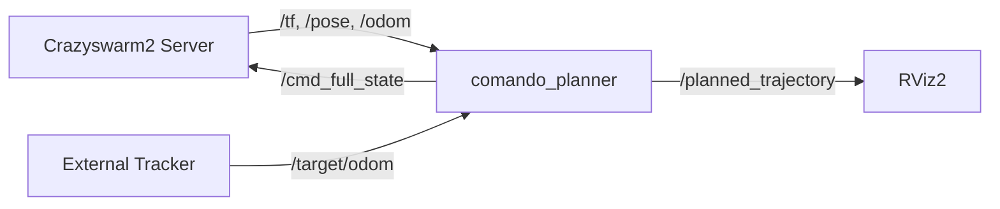

# Chapter 1: Crazyflie ROS Nodes & Interface

## 1. Overview

The `comando_planner` node acts as a direct bridge to the **Crazyswarm2** ecosystem. Unlike previous versions that used intermediate bridge nodes, this version subscribes directly to Crazyflie telemetry and publishes `FullState` commands to minimize latency and synchronization jitter.

## 2. Subscribers (Data from Crazyflie)

The planner fuses two high-rate topics to assemble the 13-dimensional state vector **x**.

### 2.1 State Vector Assembly

| Index | Field | Source Topic | Frame | Notes |
|-------|-------|--------------|-------|-------|
| 0-2 | Position | `/{drone}/pose` | World (ENU) | From MoCap |
| 3-5 | Velocity | `/{drone}/odom` | World (ENU) | From onboard Kalman |
| 6-9 | Quaternion | `/{drone}/pose` | World (ENU) | [w, x, y, z] |
| 10-12 | Angular Rate| `/{drone}/odom` | Body (FLU) | Converted to rad/s |

### 2.2 Callback Logic

The `platform::crazyflie` abstraction handles these updates.

- **Pose Callback**: Updates position and orientation.
- **Odometry Callback**: Updates linear and angular velocity.
  - **CRITICAL**: Crazyswarm2 logs angular velocity in **deg/s**. The planner automatically converts this to **rad/s** before storing it in the state vector.

```cpp
// internal conversion in crazyflie.hpp
current_state(10) = msg->twist.twist.angular.x * (M_PI / 180.0);
```

### 2.3 Target Tracking

When using relative OCPs (`stateswitch`), the planner also subscribes to:
- `target_odom_topic` (Default: `/target/odom`)
- `target_accel_topic` (Default: `/target/accel`)

These are managed by the `TargetTracker` component and passed to the solver via `TargetSnapshot`.

---

## 3. Publishers (Commands to Crazyflie)

The planner primarily uses the **Mellinger Controller** interface for high-performance tracking.

### 3.1 Topic: `/{drone}/cmd_full_state`

This topic accepts the `crazyflie_interfaces/msg/FullState` message, which includes position, velocity, orientation, angular rates, and acceleration feedforward.

### 3.2 Acceleration Feedforward (a_ff)

A key finding in the CoManDO project was that **acceleration feedforward is required** for stable tracking. Without it, the lower-level controller lags behind the MPC plan.

The planner computes $a_{ff}$ directly from the predicted thrust $f_z$ and the commanded orientation $q$:

$$a_{world} = R(q) \cdot \begin{bmatrix} 0 \\ 0 \\ f_z/m \end{bmatrix} + \begin{bmatrix} 0 \\ 0 \\ -g \end{bmatrix}$$

This is more stable than numerical differentiation of the velocity trajectory and ensures the feedforward term is consistent with the physics used by the solver.

---

## 4. Visualization & Debugging

### 4.1 Trajectory Visualization

The planner publishes the predicted horizon to `/{drone}/planned_trajectory` (`nav_msgs/msg/Path`).
- **Green/Blue Path**: The future states the MPC is aiming for.
- Use RViz2 to visualize this path alongside the drone's current pose.

### 4.2 ROS Graph Summary



---

[Next Chapter: Planner Node Setup](02_planner_node_setup.md)