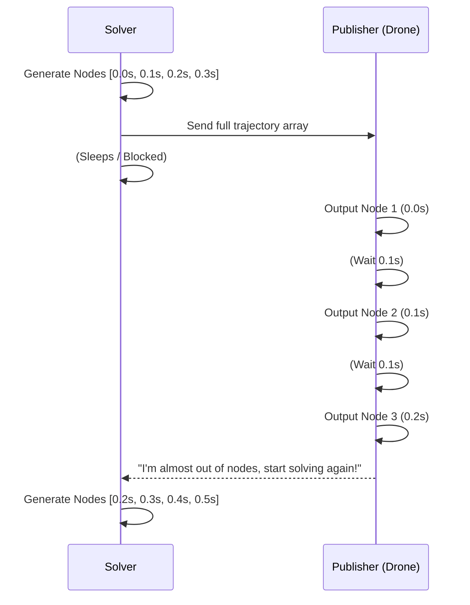
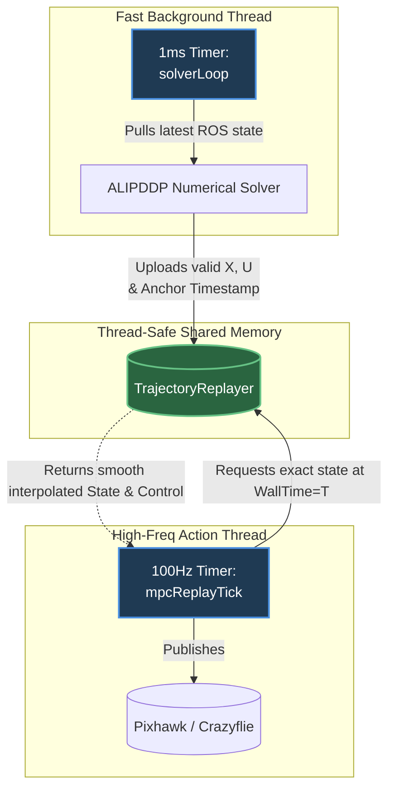

# CoManDO Planner: Asynchronous Replanning Architecture

This document logs the critical architectural changes made to transition the CoManDO planner from a discrete, tick-gated approach to a high-frequency, fully asynchronous online replanning MPC pipeline. 

## 1. The Problem with the Old Architecture

Previously, the planner used a rigid **Tick-Based Gating** system. The `solverLoop` and the `mpcReplayTick` (publisher) were tightly coupled. The system would generate a trajectory based on nodes separated by $dt$ (e.g., 0.1s), and the publisher would manually step through these nodes one by one. This forced the publisher's speed to match the trajectory's resolution, guaranteeing lag. Furthermore, the solver was intentionally delayed ("gated") from starting a new calculation until the trajectory explicitly ran out or told the solver to begin. 

The result was discontinuous trajectories, halting behavior, and time misalignment. The physical drone would receive commands that were out of sync with its real-world timestamps, causing jerking or crashing.

## 2. The Solution: Four-Pillar Asynchronous Design

### 2.1 Fully Decoupled Cadences (`planner_node.cpp`)
We split the pipeline into two entirely independent threads/timers that communicate only via a thread-safe shared memory object (`trajectory_replayer`).

*   **The Solver Loop (`solverLoop`)**: Runs as fast as legally possible (triggered every 1 ms). The moment it finishes a solve, it aggressively pulls the freshest `current_state` and starts a brand new calculation immediately. It no longer waits for permission from the publisher.
*   **The Replay Loop (`mpcReplayTick`)**: Runs exactly at the desired control frequency (e.g., 100 Hz). It never waits for the solver. It simply asks the shared memory object, *"Give me the exact state I should be in right now."*

### 2.2 Time-Continuous Interpolation (`trajectory_replayer.hpp`)
We completely eliminated the concept of "sending nodes". We rewrote the `TrajectoryReplayer` to treat the solver outputs as a continuous mathematical function over time.

Instead of sending `node[k]`, the replayer now does:
1. Computes exact elapsed time: `elapsed = current_real_time - solve_start_time`
2. Finds which two nodes bridge this `elapsed` time.
3. Performs a **linear interpolation** for position, velocity, and inputs ($x, y, z, v, f_z, m$) and **Spherical Linear Interpolation (SLERP)** for the attitude quaternion.

> [!TIP]
> This decoupling completely solves the Node vs. frequency problem! The solver can plan loosely at 10 Hz ($dt=0.1s$) for a long prediction horizon, while the Replayer can pump smooth setpoints to the drone flight controller at 100 Hz or 500 Hz without breaking a sweat!

### 2.3 Timestamp Anchoring & Network Latency Compensation (`quadrotor_mpc.cpp`)
A classic MPC failure mode is the "Time Jump Backward." If the solver starts at $t=0$ and takes 50 milliseconds to solve, the drone is already at $t=50$ ms when the trajectory is output!

*   **The Fix**: We mandated that the `solve_timestamp` is hard-anchored to the exact physical microsecond that the `x0_abs` state snapshot was requested. 
*   Because `TrajectoryReplayer` calculates elapsed time against this strict anchor, when a 50ms solve finishes, the Replay loop instantly skips the first 50ms of the output trajectory, ensuring the drone picks up the plan *exactly* where it physically is down to the millisecond. No jumping backwards.

### 2.4 Mathematical & Boundary Validation (`planner_node.cpp` & `ocp_registry.hpp`)
Because `solverLoop` runs unthrottled with live data, it will inevitably generate garbage trajectories (e.g. if the drone gets hit by wind or the solver gets stuck in a local minimum on a tight turn). We implemented a secondary gating system to protect the published setpoints:

1.  **Constraint Error (Primal Residuals)**: Added `constraint_error` passthrough directly from the ALIPDDP solver. If the solver spits out a trajectory that violates continuity or glideslope (e.g., error > 1.0), we throw the solve in the trash.
2.  **Physical Feasibility Gates**: We parse the entire timeline inside `validateTrajectory()` to check for suicidal commands across the horizon (e.g., altitudes $< -0.05m$, insane velocities $> 20$ m/s, negative thrust commands).
3.  **Fallback Persistence**: If a new solve is rejected, the `TrajectoryReplayer` completely ignores it and seamlessly continues playing the previous valid solve's timeline. This buys the solver more time to try again on the next 1ms tick without dropping the drone out of the sky.
